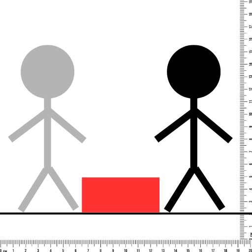

- Research shows that the human brain processes visuals 60,000 times faster than text.[link](https://oit.williams.edu/files/2010/02/using-images-effectively.pdf)
- LLMs are bad at spatial reasoning
- I want to add a benchmark in a place where AI is not able to perform well so that we can make improvements in that area moving forward.
- This task isolates learning as there is no element of Metacogniton, executive functions or social cognition.(also attention?)
- For many current systems, learning occurs only during training or in-context. However, for truly robust and adaptive behavior, AI systems should be able to learn (and retain) new knowledge and skills over time (e.g., as part of a continuous
learning process). In this benchmark we will be testing in-context learning. But the context will contain (Choices the AI made and the outcomes??)
- Task 1 (_1, _2(1,2 and 1, 3), _3)
  - Has to learn initial and final from the first 2 images.
- Task 2 (_1, _2, _3)
  - Has to learn initial and final and arrows.
  - We have provided arrows in the first 2 images but expect the LLM to learn to understand even without the arrows in the later images.
- Task 3 (_1, _2, _3)
  - The scale of the stick figures are different
  - The stick figure has to move down by 2 units.
- Task 4, 5, 6 (_1, _2, _3)
  - No scale provided, just intuition

- LLMs know about inertia but have they seen it in action (very little image training compared to text) (assume)

### Problem Statement
- Research shows that the human brain processes visuals 60,000 times faster than text.[link](https://oit.williams.edu/files/2010/02/using-images-effectively.pdf) whereas LLMs are bad at spatial reasoning.
- I want to add a benchmark in a place where AI is not able to perform well so that we can make improvements in that area moving forward.
- In this benchmark we will be testing in-context learning of LLMs from images.

This is benchmark test [learning ability](https://github.com/Anand-Joshua-Jacob/The-illusion-of-AGI/tree/main) of LLMs
You can look at the chat logs [here](https://github.com/Anand-Joshua-Jacob/The-illusion-of-AGI/tree/main/LearningFromImages/results/html)

## Datasets and Tasks

There are 3 Kaggle datasets, each with an associated Kaggle task:
Each image in the Datasets were drawn by me, so they should not appear in any model’s training data.

1. [Dataset 1 – Jumping Task](https://www.kaggle.com/datasets/anandjoshuajacob/task-jumping)
2. [Dataset 2 – No Explicit Scale](https://www.kaggle.com/datasets/anandjoshuajacob/stickfigures-without-explicit-scale)
3. [Dataset 3 – Relabelled Directions](https://www.kaggle.com/datasets/anandjoshuajacob/visual-learning-3)

---

### Core Task Setup (All Datasets)

- Each dataset has 5 subtasks (e.g., `task1_1` to `task1_5`)
- Each subtask has 4 images:
  - **3 example images** (options A, B, C): show basic movements to the right, left and up.
  - **1 target image** (image 4): same for all subtasks in all 3 datasets.  
  - The first 3 images are presented to the LLM as **option A**, **option B**, and **option C**.
  - Target Image:  
      
  - The **fourth image** (target) always shows:
    - Initial stickman position on the **left**
    - Final stickman position on the **right**
    - A **red region** between them that must be avoided
  - The LLM is told:
    - To avoid red.
    - Normal laws of physics apply.
    - It must find the **shortest sequence of moves** (a sequence over {A, B, C}) that reproduces the motion in the target image.
  
  
  ---
  ### Dataset 1 – Task Jumping
  **Link:** [Dataset 1 on Kaggle](https://www.kaggle.com/datasets/anandjoshuajacob/task-jumping)  
  - Contains **5 subtasks**: `task1_1` to `task1_5`. Each subtask has 4 images.
  #### Progressively Reduced Annotations
  - **`task1_1`**:
    - Each image shows **two stickmen**:
      - **Gray stickman**: initial position
      - **Black stickman**: final position
    - images indicating movement have:
      - **Labels** for initial and final positions.
      - **Arrows** indicating direction of motion.
    - Target image:
      - Only shows gray and black stickmen (no labels, no arrows).
    - LLM has to **learn** the gray and black stickman represents initial and final positions.
  - **`task1_2` to `task1_4`**:
    - The first image still has labels and arrows.
    - Labels/arrows are **gradually removed** in images 2 and 3.
    - The LLM has fewer explicit cues to interpret the motions.
  - **`task1_5`**:
    - Only the **first** image includes labels and arrows.
    - The remaining two images and the target image:
      - Show only gray and black stickmen.
      - No labels or arrows.
    - This tests how quickly and reliably the LLM can internalize the visual conventions.
  #### Additional Visual Cues
  - A **scale** is shown in both the **X and Y directions**.
  - This allows the LLM to see that the stickman moves specific distances from one position to another and to compare these movements.
  
  #### Challenge for the LLM
    - **Learn** what the Gray and Black stick man represent.
    - **Infer** what each option (A, B, C) does from the images.
    - **Infer** what the target image represents.
    - **Reason** and come up with a minimal action sequence that matches the target.

  #### Correct reasoning:  
  - Moving right first leads the stickman directly into the red region. The shortest valid sequence is:
    1. **Jump (up)** to clear the obstacle.
    2. **Move right** and then fall due to gravity.
  - So the correct sequence in Dataset 1 is `"CA"` (jump, then move right).
  ---
  ### Dataset 2 – Without Explicit Scale
  **Link:** [Dataset 2 on Kaggle](https://www.kaggle.com/datasets/anandjoshuajacob/stickfigures-without-explicit-scale)
  - Contains **5 subtasks**: `task2_1` to `task2_5`.
  - Structurally the **same as Dataset 1**, but:
    - There is **no explicit X/Y scale** in the images.
  #### Motivation
  In Dataset 1, many LLMs responded by reasoning in terms of exact units, e.g.,  
  “The stick figure moved X units to the right from coordinate (a, b) to (c, d).”
  For Dataset 2:
  - The scale is **removed**.
  - The LLM must:
    - Internally form approximate representations of vertical and lateral movements.
    - Compare these to the target image to determine which sequence recreates the target displacement.
  - The **correct sequence** remains:
    - Jump, then move right → `"CA"`.
  ---
  ### Dataset 3 – Relabelled Directions
  **Link:** [Dataset 3 on Kaggle](https://www.kaggle.com/datasets/anandjoshuajacob/visual-learning-3)
  - Contains **5 subtasks**: `task3_1` to `task3_5`.
  - Same overall logic as Dataset 1, but **option meanings are permuted**.
  #### Changed Option Mapping
  - **Option A** → movement **up**
  - **Option B** → movement **left**
  - **Option C** → movement **right**
 #### Motivation
  - Left and right are opposites, so it is relatively easy for an LLM to relate labels and arrows between left/right images.
  - This dataset tests whether the LLM can:
    - Transfer what it learns from an **“up”** image (jump) to **lateral** movement images and to the target image.
    - Correctly reinterpret the new labeling of options.
  - The **correct sequence** is:
    - Jump, then move right → `"AC"` in this case.
  ---
  ### Benchmark Construction and Scoring
  - There are **3 Kaggle tasks**, one for each dataset.
  - Each Kaggle task has **5 subtasks**.
  #### Per-Dataset Scoring
  For each dataset:
  1. Each of the 5 subtasks is run for **5 trials**.
  2. In each trial:
    - If the LLM’s **final answer sequence** is correct irrespective of reasoning quality → **1 point**
    - Otherwise → **0 points**
  3. The **dataset score** is:
    \[
    \text{Score} = \frac{\text{Number of correct sequences}}{5 \text{ subtasks} \times 5 \text{ trials}} = \frac{\text{Correct}}{25}
    \]
  #### Overall Benchmark Score
  - The **Kaggle benchmark score** is the **average** of the scores over the **3 Kaggle tasks** (one per dataset).
  Formally:
  \[
  \text{Benchmark Score} = \frac{\text{Score}_{\text{Dataset 1}} + \text{Score}_{\text{Dataset 2}} + \text{Score}_{\text{Dataset 3}}}{3}
  \]
  ---
- Each image has 2 stickmen:
  - Grey stickman: initial position.
  - Black stickman: final position.
- The model sees the 3 example images as options A, B, and C, then must choose a sequence of options that achieves the target configuration.
- The red area is an obstacle and must be avoided; normal physics (including gravity) apply.
- The shortest valid sequence is:
  - Jump (up) first, then move right.
  - The correct sequence in Dataset 1 is `"CA"` (C = up, A = right).

The model must:
1. Learn the visual conventions (grey vs black, arrows, labels).
2. Understand what each example image represents.
3. Infer the shortest sequence of moves for the target.
4. Output both a reasoning field and a final answer sequence.

---

## Dataset 1: Task Jumping

**Link:** https://www.kaggle.com/datasets/anandjoshuajacob/task-jumping  

- 5 subtasks: `task1_1` to `task1_5`.
- Example images include:
  - Arrows showing direction of movement.
  - Labels for initial and final positions.
  - A reference scale on both X and Y axes.

**Target image:**
- Same across all subtasks.
- Contains only the grey (initial) and black (final) stickmen, no labels or arrows.

**Progressive removal of cues:**
- `task1_1`: All three example images have labels and arrows; the target has none.
- `task1_2`–`task1_4`: Labels/arrows are gradually removed from the second and third example images.
- `task1_5`: Only the first example image has labels/arrows; the other two example images and the target image have only grey and black stickmen.

This tests:
- How quickly the model can learn and generalize the visual conventions.
- Whether it can still reason correctly as explicit cues are reduced.

**Correct answer:** `"CA"` (jump, then move right).

---

## Dataset 2: No Explicit Scale

**Link:** https://www.kaggle.com/datasets/anandjoshuajacob/stickfigures-without-explicit-scale  

- 5 subtasks: `task2_1` to `task2_5`.
- Same setup as Dataset 1, but:
  - No explicit X/Y scale is shown.

Motivation:
- Many models naturally reason like “the stick figure moved X units from this coordinate to that coordinate.”
- This dataset removes explicit scales, forcing models to use internal, approximate representations of movement (up vs sideways, relative distances) and compare them visually to the target.

**Correct answer:** `"CA"` (jump, then move right), same as Dataset 1.

---

## Dataset 3: Option Order Change

**Link:** https://www.kaggle.com/datasets/anandjoshuajacob/visual-learning-3  

- 5 subtasks: `task3_1` to `task3_5`.
- Same visual structure as Dataset 1, but the option ordering changes:
  - Option A: up
  - Option B: left
  - Option C: right

Rationale:
- Horizontal left/right moves are opposites and easier to relate.
- Here, I test if the model can:
  - Transfer understanding of labels and arrows from an “up” image to lateral movement images and the target.
  - Correctly adapt when the option mapping changes.

**Correct answer:** `"AC"` (jump, then move right, given the new option order).

---

## Benchmark Construction and Scoring

- There are 3 Kaggle tasks (one per dataset).
- Each Kaggle task has 5 subtasks.
- For each subtask:
  - The model is run for 5 trials.
  - Each correct final answer sequence = 1 point, incorrect = 0.
- Score per Kaggle task:
  - Average over 25 runs (5 subtasks × 5 trials).
- Overall benchmark score:
  - Average of the 3 Kaggle task scores.

---

### Dataset and Task
The benchmark consists of 3 Kaggle tasks corresponding to 3 Kaggle datasets. All the images in the datasets are drawn by me so we can be sure that the LLMs have never seen them while training.

#### [Dataset 1](https://www.kaggle.com/datasets/anandjoshuajacob/task-jumping) and Task 1
- Consists of 5 sub tasks named task1_1, task1_2, task1_3, task1_4 and task1_5
- Each sub task consists of 4 images and each image consists of 2 stickmen, a grey stickman denoting initial position and a black stickman denoting final position.
- The 1st, 2nd and 3rd images show movement of the stickman to the right, left and upwards. The LLM is given these 3 images as option A, option B and option C
- Then it is given a target image which is the 4th image that shows initial stickman on the left and final stickman on the right with a red region in between. 
- The target image (4th image) is same across all the tasks. The LLM is told to avoid the red, and that normal rules of physics apply. It is now tasked with finding the shortest sequence of moves to achieve what is shown in the target image.
- Since the stickman will immediately hit the red block if it moves right first, the correct sequence is to jump first and then move right after which it will come down due to gravity. Hence the correct answer is "CA".
- In task1_1 the 3 images showing movement have labels denoting initial and final position and an arrow indicating the direction of movement, but the target image just contains the gray stickman and black stickman. The LLM is tested on it's ability to learn the conventions and understand that gray stickman represents initial position and black stickman represents final position.
- In the other tasks the first image contains both labels and arrows but these are gradually removed in images 2 and 3. In task 1_5 only the first image has labels and arrows, the 2 remaining images showing stickman movement and the final target image contain only a gray stickman and black stickman(initial and final position). The target image does not contain labels or arrows in any task. I want to test how fast the LLM can learn the conventions of the labels and arrows. 
- The LLM has to **learn** these conventions and understand what each image represents and what it has to do in the final image. Then it has to come up with the correct sequence that achieves what is shown in the final image.
- As tasks progress the LLM gets fewer examples to learn the conventions from.
- A reference scale is shown in the X and Y direction for the LLM to see that the stickman has moved from this position to that.
- The LLM is asked to output a reasoning field and final answer sequence. If the final answer sequence is right the LLM passes the task.

#### [Dataset 2](https://www.kaggle.com/datasets/anandjoshuajacob/stickfigures-without-explicit-scale) and Task 2
- Consists of 5 sub tasks named task2_1, task2_2, task2_3, task2_4 and task2_5
- All tasks are the same as Task 1 but without a scales in the X and Y directions.
- Most LLMs reasoned saying the Stick figure moved x units to the right from this coordinate to that one. So I wanted to see how they would perform if no explicit scale was provided for the LLMs to make these calculations. They have to internally form representations of the stickman moving up or sideways by some units and roughly compare them to the target image movement before coming up with the final answer sequence.
- The Correct sequence like in Task1 is to Jump and move right i.e. "CA".

#### [Dataset 3](https://www.kaggle.com/datasets/anandjoshuajacob/visual-learning-3) and Task 3
- Consists of 5 sub tasks named task3_1, task3_2, task3_3, task3_4 and task3_5
- All tasks are the same as Task 1 but the sequence of the options is changed to option A - up, option B - left, option C - right. 
- Right and left are just opposites of each other, so it is easy for the LLM to understand and relate the labels and arrows present in the Right image to the left image and so on.
- I now want to test if the LLM can relate labels and arrows in an "up" image to lateral movement images and target image.
- The Correct sequence is again to Jump and move right i.e. "AC" in this case.

### Task & benchmark construction
- I have created 3 Kaggle tasks corresponding to the 3 Kaggle Datasets above. Each kaggle task has 5 sub tasks.
- For scoring, Each subtask is run for 5 trials and each time the LLM gets the sequence right, it gets 1 point and 0 otherwise. The final score is the average of the 25 runs (5 subtasks * 5 trials)
- The Kaggle benchmark score is an average of the score on the 3 Kaggle tasks.

### Technical details 
- This task isolates learning and reasoning as there is no element of Metacogniton, executive functions or social cognition. It may contain some attention too as to which part of the image to focus on, but all LLMs are very good at this and it does not affect the final score.

### Results, insights, and conclusions
- For the task, I modified the prompt to make it easier for the LLM to get a reasonable score. But during this I was using google/gemini 3 flash preview. It seems to have fine-tuned the task to be easy for this particular model and so gemini 3 flash preview perform consistently well. 
- Also when I ran the task on a text only model, it guessed the right answer simply by guessing what the each image and the final task would be simply based on my prompt. So maybe the LLMs are not learning purely based on what they see in the images.

### Organizational affiliations
Working in a Japanese Automobile company, nothing crazy. 

### References & citations
https://oit.williams.edu/files/2010/02/using-images-effectively.pdf